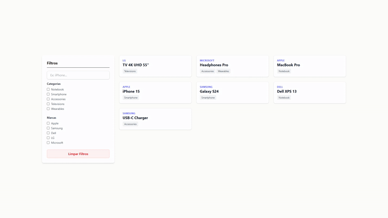

# 🚀 Moot Challenge - Mecanismo de Busca Reativo

Este projeto consiste em um desafio técnico para implementar um mecanismo de busca utilizando **Laravel** e **Livewire**. O objetivo é oferecer uma experiência de filtragem fluida, persistente e performática, seguindo critérios de código limpo e organização.

A integridade deste projeto é garantida por **GitHub Actions**, que executa automaticamente a suíte de testes em cada push para o repositório.



## 📋 Requisitos do Projeto

Com base nas especificações técnicas fornecidas, o projeto entrega:

* 🔍 **Mecanismo de Busca:** Implementação reativa com Laravel Livewire.
* 🧩 **Filtros Combinados:** Busca lógica utilizando Nome do Produto (E) Categoria (E) Marca.
* 🗂️ **Seleção Múltipla:** Possibilidade de selecionar várias categorias ou marcas simultaneamente.
* 🔄 **Persistência de Dados:** Parâmetros de busca persistentes através da URL (Query String).
* 🧹 **Limpeza de Estado:** Botão dedicado para limpar todos os filtros de pesquisa.
* 🏗️ **Fundação Sólida:** Estrutura baseada em Migrations, Factories e Seeders para carga inicial.
* 🧪 **Testes de Feature:** Implementação de testes automatizados utilizando Pest e Livewire.

---

## 🛠️ Instalação e Configuração (Docker Sail)

O ambiente de desenvolvimento é inteiramente baseado em Docker. Siga os passos abaixo:

### 1. Clonar o Repositório
```bash
git clone https://github.com/wallaceb-dev/moot-challange.git
```
```bash
cd moot-challange
```

### 2. Configurar o Ambiente (.env)
Crie o arquivo de configuração a partir do exemplo:
```bash
cp .env.example .env
```

> Nota sobre a Porta 80: Se houver serviços utilizando a porta 80 no host (ex: Apache), desative-os (sudo systemctl stop apache2) ou altere a variável APP_PORT no .env para uma porta livre como 8080.

Configurações obrigatórias no .env:
```bash
DB_CONNECTION=mysql
DB_HOST=mysql
DB_PORT=3306
DB_DATABASE=laravel
DB_USERNAME=sail
DB_PASSWORD=password
```

### 3. Instalar Dependências (Composer)
Utilize um container temporário para instalar as dependências sem precisar de PHP local:

```bash
docker run --rm \
    -u "$(id -u):$(id -g)" \
    -v "$(pwd):/var/www" \
    -w /var/www \
    laravelsail/php83-composer:latest \
    composer install --ignore-platform-reqs
```

### 4. Inicializar Containers
Suba os serviços do Docker utilizando o Laravel Sail:
```bash
./vendor/bin/sail up -d
```

### 5. Migrações e Seeders
Crie as tabelas e popule o banco de dados:
```bash
./vendor/bin/sail artisan migrate --seed
```

---

## 🧪 Testes Automatizados

Para validar os critérios de aceitação e garantir a integridade dos filtros:

```bash
./vendor/bin/sail artisan test
```

---

## ⚙️ Tecnologias Utilizadas
* 🐘 Framework: Laravel (PHP 8.3)
* ⚡ Reatividade: Livewire 3
* 🎨 Estilização: Tailwind CSS
* 🐳 Ambiente: Docker (Laravel Sail)
* 🧪 Testes: Pest PHP
* 🚀 CI/CD: GitHub Actions